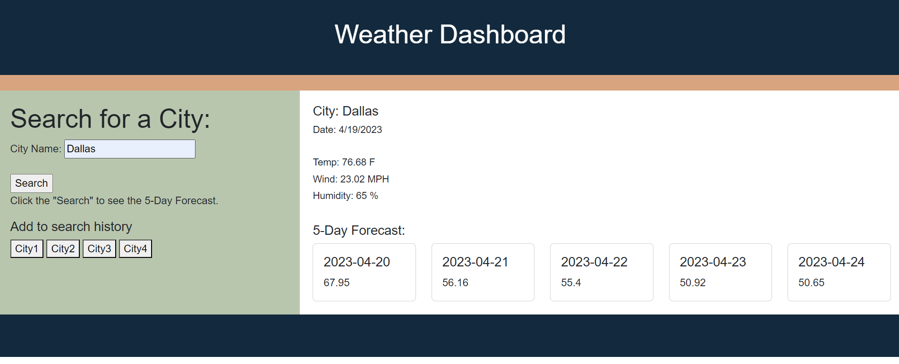

# Weather Dashboard

## Description

This is Challenge #6, this project builds a weather dashboard runs in the browser and feature dynamically updated HTML and CSS.

 Third-party APIs allow developers to access their data and functionality by making requests with specific parameters to a URL. Developers are often tasked with retrieving data from another application's API and using it in the context of their own. 

 The [5 Day Weather Forecast](https://openweathermap.org/forecast5) is utilized to retrieve weather data for cities. The base URL should look like the following: `https://api.openweathermap.org/data/2.5/forecast?lat={lat}&lon={lon}&appid={API key}`. 
 
 After registering for a new API key, the API key will activate.

To store any persistent data, `localStorage` is used.

## User Story

A traveler:
Wants to see the weather outlook for multiple cities
to plan a trip accordingly

## Functionality

The user is presented a weather dashboard with form inputs.

When the user searches for a city, the user is presented with current and future conditions for that city and that city is added to the search history.

When the user views current weather conditions for that city, the user is presented with the city name, the date, an icon representation of weather conditions, the temperature, the humidity, and the wind speed.

When the user views future weather conditions for that city, the user is presented with a 5-day forecast that displays the date, an icon representation of weather conditions, the temperature, the wind speed, and the humidity.

When the user clicks on a city in the search history, the user is presented with current and future conditions for that city

## Mock-Up

A mock-up can be found in .assets/images06-server-side-apis-homework-demo.png
A screenshot of this challenge can be found in /.assets/images/screenshot-of-weather-dashboard.png

## Screenshot

## Location

The URL of the functional, deployed application: https://dawn-kline-m.github.io/WeatherDashboard/

The URL of the GitHub repository: https://github.com/dawn-kline-m/WeatherDashboard

## Assistance

I used some code from previous lessons as starter code.  I received assistance from my instructor and TA.  I also received guidance from my tutors, TA and instructor. 
